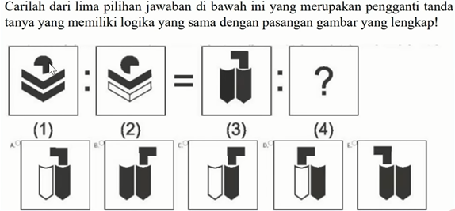
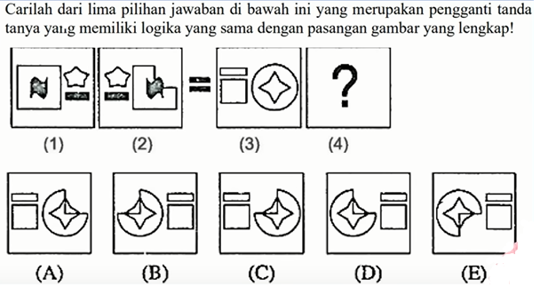

# Analogi Gambar
Analogi gambar melibatkan penyelesaian pola atau hubungan antara gambar. Contoh tugas ini adalah mencari gambar yang memiliki hubungan yang sama dengan dua gambar yang diberikan. Peserta diminta untuk memilih salah satu gambar dari beberapa pilihan yang menunjukkan hubungan yang sama.

**Contoh Soal**

<strong>Jawaban Contoh 1: D</strong>

**Contoh 2 Analogi Gambar**

<strong>Jawaban Contoh 2: D</strong>

## Video Penjelasan Kemampuan Figural

  <iframe 
    style={{ position: 'absolute', top: 0, left: 0, width: '100%', height: '100%' }} 
    src="https://www.youtube.com/embed/Wdm5EeJ3TNQ" 
    title="YouTube video player" 
    frameBorder="0" 
    allow="accelerometer; autoplay; clipboard-write; encrypted-media; gyroscope; picture-in-picture" 
    allowFullScreen
  />

