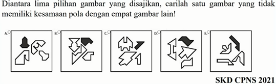
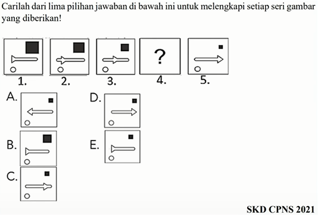
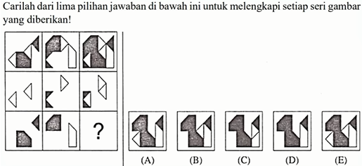

# Ketesamaan Gambar
Ketesamaan gambar mengharuskan peserta untuk mencocokkan gambar yang serupa atau identik. Tugas ini biasanya terdiri dari satu gambar yang diberikan dan beberapa gambar pilihan. Peserta harus menemukan gambar yang paling mirip atau identik dengan gambar yang diberikan.

**Contoh 1 Ketesamaan Gambar**

**Contoh 2 Ketesamaan Gambar**

## 3. Seri Gambar
Seri gambar melibatkan penyelesaian pola atau urutan gambar. Dalam tugas ini, peserta harus menentukan gambar mana yang seharusnya muncul berikutnya dalam urutan berdasarkan pola yang ada. Ini menguji kemampuan peserta dalam memahami dan menerapkan logika dalam urutan gambar.

**Contoh 1 Seri Gambar**

**Contoh 2 Seri Gambar**

