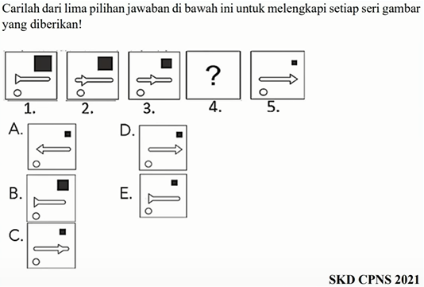
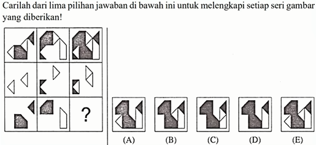

# Seri Gambar
Seri gambar melibatkan penyelesaian pola atau urutan gambar. Dalam tugas ini, peserta harus menentukan gambar mana yang seharusnya muncul berikutnya dalam urutan berdasarkan pola yang ada. Ini menguji kemampuan peserta dalam memahami dan menerapkan logika dalam urutan gambar.

**Contoh 1 Seri Gambar**

**Contoh 2 Seri Gambar**

