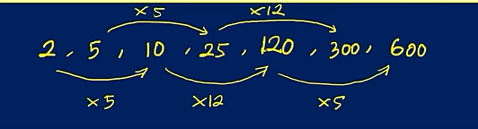
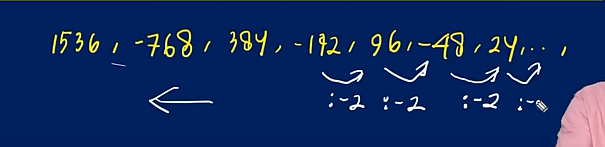
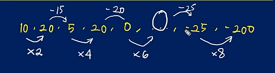
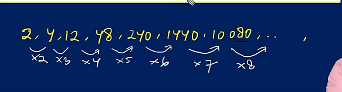
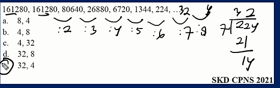

import DeretAritmatika from '@site/src/components/Arimatika/DeretAritmatika';

# Kemampuan Numerik: Soal Deret Bilangan

### Soal Deret dalam Tes Intelegensia Umum (TIU)

Soal deret dalam Tes Intelegensia Umum (TIU) merupakan bagian  dari barisan angka yang mengikuti pola tertentu. Deret ini memiliki pola khusus untuk setiap suku, yang bisa melibatkan berbagai jenis operasi matematika, seperti:

- Penjumlahan
- Pengurangan
- Perkalian
- Pembagian
- Gabungan operasi (misalnya penjumlahan dan perkalian)
- Pangkat
- Operasi lainnya

### Contoh Soal SKD CPNS 2023

Diberikan deret angka berikut: 2, 5, 10, 25, ..., 300, 600 temukan suku berikutnya dalam deret ini.

**Pilihan Jawaban:**

a. 100  
b. 120  
c. 150  
d. 30  
e. 60

<strong>Jawaban:</strong> b. 120

Pola deret:

### Contoh Soal SKD CPNS 2021

1536, -768, 384, -192, 96, -48, 24, ..., ...

**Pilihan Jawaban:**

a. 8, -4  
b. -8, 4  
c. -8, 2  
d. 12, -6  
e. -12, 6 

<strong>Jawaban:</strong>e. -12, 6 

Pola deret:

### Contoh Soal SKD CPNS 2023

10, 20, 5, 20, 0, ..., -25, -200

**Pilihan Jawaban:**

a. -25
b. -20  
c. 0  
d. 20  
e. 25 

<strong>Jawaban:</strong> C. 0

Pola deret:

### Contoh Soal SKD CPNS 2021

2, 4, 12, 48, 240, 1440, 10080, ..., ....

**Pilihan Jawaban:**

- a. 80640, 725760
- b. 80540, 725760
- c. 70560, 564480
- d. 70560, 564480
- e. 90720, 907200

<strong>Jawaban:</strong> a. 80640, 725760

Pola deret:

### Contoh Soal SKD CPNS 2021

161280, 161280, 80640, 26880, 6720, 1344, 224, ...

**Pilihan Jawaban:**

- a. 8, 4
- b. 4, 8 
- c. 4, 32
- d. 32, 8
- e. 32, 4 

<strong>Jawaban:</strong> e. 32, 4

Pola deret:

## Video Penjelasan Soal Deret Bilangan

  <iframe 
    style={{ position: 'absolute', top: 0, left: 0, width: '100%', height: '100%' }} 
    src="https://www.youtube.com/embed/AAWBTaIKJCY" 
    title="YouTube video player" 
    frameBorder="0" 
    allow="accelerometer; autoplay; clipboard-write; encrypted-media; gyroscope; picture-in-picture" 
    allowFullScreen
  />

